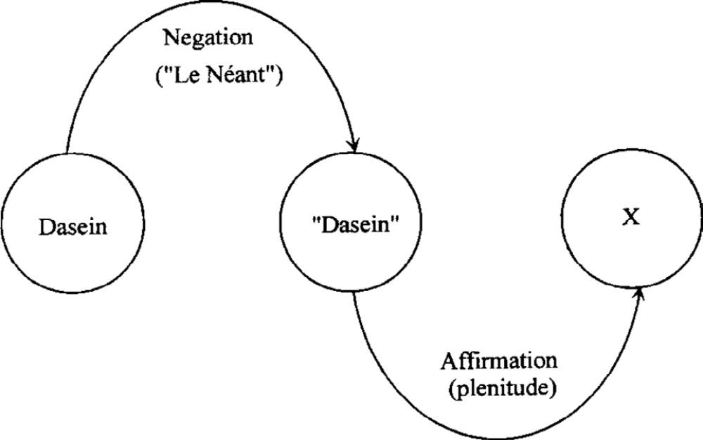
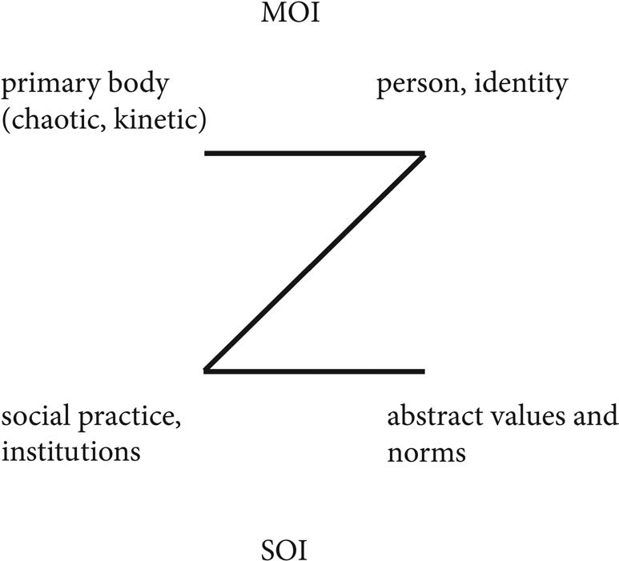
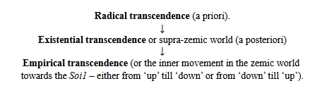
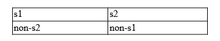
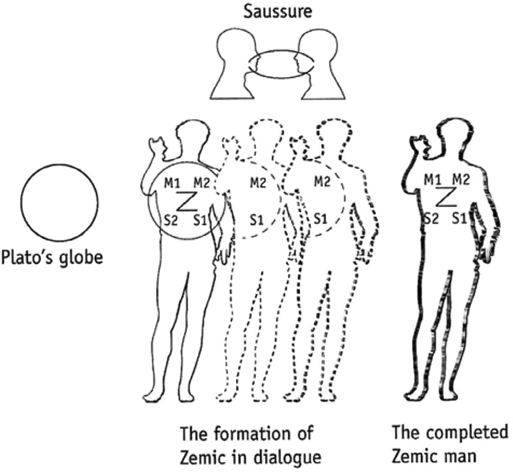
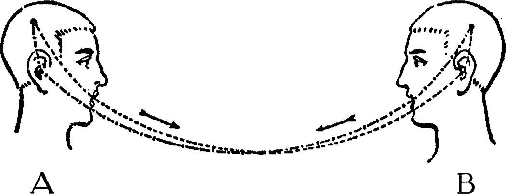
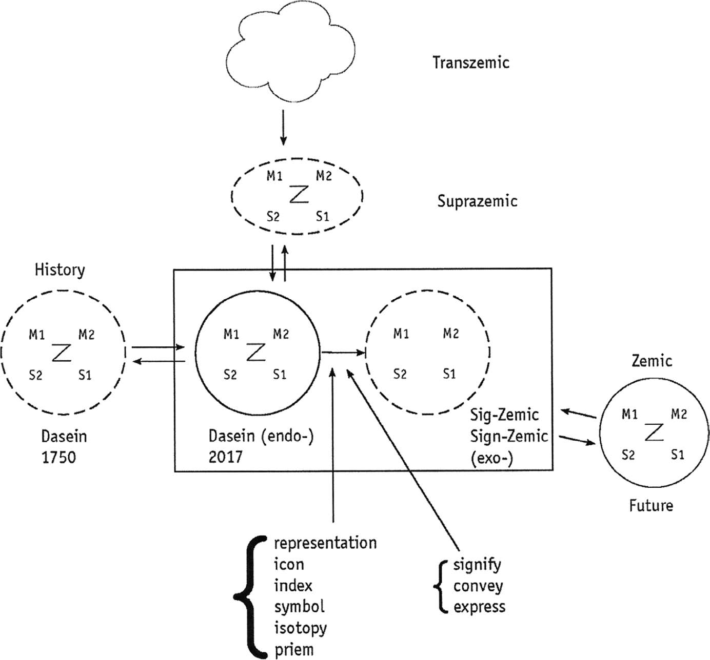

# Exixtentiality and Semiotics -- Are They Compatible?

*Eero Tarasti*

**Table of Contents**

[1. Introduction 1](#introduction)

[2. Philosophical concepts 5](#philosophical-concepts)

[2.1 Dasein 5](#dasein)

[2.2 Being and not-being 6](#being-and-not-being)

[2.3 Transcendence 7](#transcendence)

[2.4 Existentializing semiotics 9](#existentializing-semiotics)

[2.5 The semiotic square becoming 'zemic' model
11](#the-semiotic-square-becoming-zemic-model)

[2.6 Existential communication 14](#existential-communication)

[References 16](#references)

## 1. Introduction

(63:1) An invitation to write to the anthology of *Existential Human
Science* by Routledge is a true challenge to my own work, which, during
the last three decades, has focused on the elaboration of a theory I
call 'existential semiotics'. I have already published on it so
abundantly in various languages and lectured around it in many countries
to most diverse audiences that it is high time to gather some possible
results and ponder the present state of this approach, its reception and
future -- if it has a future. The last-mentioned self-critical and
sceptical comment may be taken as an encouragement to reflect deeper on
whether existential semiotics has really proved to be that new paradigm
of human sciences to which it was originally intended. What is involved
namely is to blend together two different themes: for the first, what is
known about existentiality or consideration of it as an object of
scientific discourse without being scared of the critics which one has
often heard in the form that man cannot be himself object of his own
science because he already is its subject.

(63:2) Existentiality, in the sense as it is here understood, refers
strongly to the so-called continental philosophy and to its branch,
which developed in Germany from the 18th century and which has been
taken as the fundamental metalanguage regarding man's 'being' and
'existing' -- what Kierkegaard already mentioned by saying that one
would think it to be world's easiest thing but which was one of the most
difficult tasks (Kierkegaard 1993). Of course, taking into account the
human subject is no privilege of Germans' idealist and speculative
philosophy. In its many forms, it appears also in the phases of the
Angloanalytic school beginning from Wittgenstein until McTaggart (see
his *Nature of Existence*, 1988); yet, somehow the subject they are
talking about and whose world view they portray is different from Kant's
transcendental ego or Hegelian world spirit or Heideggerian *das Man* or
Jaspers' living creatures in *Dasein* (1948). Not to mention the subject
of the Frenchmen beginning from *le moi profond* by Henri Bergson (1938,
1939), or the responsibility carrying and the choice-making subject of
Sartre and de Beauvoir. There the fact that one speaks about a subject
does not tell yet much of what is in fact involved.

(63:3) In such an approach as semiotics, in turn, the prevailing trend
has been to deny the existing subject, to deprive any epistemic value of
it and even the complete ruining of subject and effort to show it as a
mere illusion, erroneous reasoning of mankind. Semiotics has --
according to its name -- been interested in objects and particularly in
signs which it thinks to support the sig- nifications. They exist
objectively regardless of what an individual subject might think of them
or how it experiences them. They have their own laws which can be
formulated as exactly as in natural sciences. Thanks to this semiotics
is strongly characterized by a certain instrumentality, i.e. it aims for
rendering its concepts **operational** tools in the analysis of
phenomena. In this sense, according to the critics, semiotics is a kind
of technological science and the expansion of the sign universe in the
digital age has given still more ground for such arguments.

(64:1) Therefore, if someone dares to speak about existential semiotics,
is he not putting water and fire to the same vessel, is he not trying
something which is *contradictio in adiecto*, bringing together
incompatible issues. However, let us not allow such criticism to depress
our scholars. Often precisely new, surprising combinations and
connections yield to the world of science something radically new if one
approaches it without prejudices. Yet, this is just very difficult.

(64:2) What does it mean to semiotize continental philosophy? (See
Tarasti 2021, 2012b, 2015). By which right some linguist, sociologist,
aesthetician, arts scholar goes and changes what Heidegger said about
the subject? However, to speak about subject, meanings, and existence is
by no means a privilege of any school or discipline in this world.
Correspondingly, on which ground the iron firm semiotic categories are
scrutinized by German metaphysics, a thought which ought to be a long
time ago an abandoned standpoint and declared as 'a conceptual poetry'?
To this one may answer that despite the standardized schools of
semiotics around such undeniably great figures as Peirce, Greimas,
Lotman, Eco, and Sebeok, there is no reason to argue that semiotics
would stay forever with those truths which these great men have defined
and elaborated. Peirce spoke about the fallibilism of science and about
the fact one always proceeds towards new, bet- ter models and ideas. As
early as the Vienna Circle in its time took a rejective attitude towards
semiotics; if the semantics was still somehow understood by Neurath,
Carnap, and Frege, then semiotics was something '*altväterisch*' and
schematic. Yet, Carnap, in his *Der logische Aufbau der Welt* (1928) and
its constitutional system of the world, bases it on the category of the
auto-psychic (*eigenseelig*) whose content of consciousness *das
Gegebene* was however subjectless. Moreover, the speech about the
subject was almost banned since the days of structuralism ... or rather
Russian formalism. Decisive was dialogue or rather the lack of it
between Claude Lévi-Strauss and Jean- Paul Sartre concerning his work
*Critique de la raison dialectique* (1960) in which existentialism had
to give the way to structuralism. Hence Parisian structuralists had all
negative attitudes towards the concept of the subject. Perhaps the best
known was the definition by Michel Foucault in his Les mots et les
choses in 1970: man was an only recent discovery that disappears as soon
as our knowledge reaches a new configuration. Man or subject did not,
therefore, exist at all and even less could one speak of its
'existence', but it was only a meeting point of systems, the product of
the Saussurean *langue* or *effet de sens* by Greimas school, meaning
the effect on the surface level (Greimas and Courtes 1979, 116).

(64:3) Accordingly, if we think that existential semiotics is a
combination of continental philosophy and classical semiotics in the
line of Peirce, Saussure, Jakobson, Lévi-Strauss, Eco, Greimas, and
Lotman, what do we try to show by this combination and gathering them
under the same nomination ... and which consequence it will have for
both approaches? For the first, continental philosophy is a very broad
notion, it consists of many schools like structuralism, phenomenol- ogy,
existentialism, hermeneutics, deconstruction, postmodern studies, etc.,
which seem to speak different languages but which are all interrelated.
Even so much that if one nowadays goes to speak in a congress of one of
them, the same speech would be as valid in phenomenology, her-
meneutics, and semiotics. In the cultural geographic respect, the French
philosophy, which can be considered entirely its own world, is most
closely related to the German one. Sartre's *L'être et le néant* (1943)
is based on Hegel's *Wissenschaft der Logik* (1832-45/1969), as much as
the definition of myths by the Lotman school is indebted to the
neo-Kantian philosopher Ernst Cassirer in his *Philosophy of Symbolic
Forms* (the chapter *Das mythische Denken*, Cassirer 1925). From this
point of view, it is not unusual if one in existential semiotics dares
to create bridges between these two universes of signification.

(65:1) Next, I try to observe the new concepts launched by existential
semiotics, from the viewpoint of continental philosophy: that means to
study how the concepts of Hegel, Kant, Kierkegaard, (Kierkegaard 1993),
Heidegger, and Jaspers become transformed when they are brought to the
context of semiotic observation. Yet, the transformation is mutual. One
has as well to ponder how the basic concepts of semiotics are changed
when they are brought to a broader philo- sophical framework. In any
case, existential semiotics endeavours in Greimas' words, to be the
surrounding theory, englobant which swallows its previous surrounded
models which now prove to be its special cases -- if therefore sign is
no longer *signifiant* plus *signifié* but whatsoever from genosigns and
phenosigns to as-if-signs or sig-zemic (see later), one is already
renewing the whole foundation of semiotics. However, it belongs to the
nature of semiotics that it includes competing views which do not
necessarily understand each other, but that has not made any harm. One
still has been able to maintain the discourse. Albeit someone would
shout from the audience: 'I hate transcendence', it has been rather apt
to instigate more about this notion which is certainly not found as
little as other key terms of existential semiotics in the major
encyclopedias of semiotics. Does it thus hold true for existential
semiotics, what Saussure said about his own structural linguistics and
'semiology': it did not exist yet but it had the right for it in
advance.

(65:2) Nevertheless, in any case, when we speak about existential
semiotics as the combination of classical semiotics and continental
philosophy, we are not connecting to the same union what- soever
semiotics and whatsoever philosophy. Choice has taken place. The new
theory does not deny the old one, or whatsoever classical semiotic
theory which is inserted to this new para- digm, it remains valid in its
own genre and original context ... and then we just think of Peirce,
Saussure, Greimas, Eco, and Lotman. Correspondingly, we do not interpret
semiotics in the light of any philosophy, but we have chosen those which
seem to be relevant. The essential is the end result, i.e. whether new
coherent metalanguage emerged from that combination, about the phenomena
as its object or subject as an existing entity.

(65:3) In the following, I shall divide my examination of existential
semiotics as particular human- istic research into two sections: first,
I ponder which philosophy it has to take into account, i.e. in the light
of which philosophers and their theories this new semiotics will be
built. I take the liberty to use the term 'new' as earlier I already
spoke many times in the congresses of the IASS about the so-called
'neosemiotics' although even this has been dealt with a fairly long
time. In science, all takes place slowly.

(65:4) Second, I shall think about which semiotics concepts I shall
include, to which extent I shall stay faithful to Greimas' school, which
theories in the framework of Paris school are already hinting towards
the existential direction like the invention of modalities in the 1970s
(Greimas and Courtes 1979, 230--232), that 'third semiotic revolution'
according to the Master (in his speech at the Third symposium of the
Semiotic Society of Finland, in the Jyväskylä University, 1983). Yet,
paradoxically also at the same time to the most rigorous angloanalytic
direction theories like deontic logic which had been developed by the
Finnish philosopher Georg Henrik v. Wright (1963), the follower of
Ludwig Wittgenstein in his chair in Cambridge (Wittgenstein 1922/1971).
One can thus pose the question of Jean Cocteau: *Jusqu'ou on peut aller
trop loin* (Cocteau 1918; Cocteau 1979) when one adopts from old
classical semiotics theories as ingredients to the 'new' existential
semiotics. How far can we stay faithful to Greimas, Eco, or Lotman at
the same time when we try to become existential semioticians?

## 2. Philosophical concepts

### 2.1 Dasein

(66:1) My first model about existential semiotics was published in my
book on the theme at Indiana Uni- versity Press (Tarasti 2000). To a
great extent, it starts with the idea of Dasein. The term again is
borrowed from Heidegger and Karl Jaspers. For them, the Dasein -- note I
always leave this term untranslated due to its subtle nuances of German
language and references to 'being', i.e. sein -- means the world in
which we live. In Heidegger, the emphasis is on my world, i.e. the
subject itself, whereas in a broader sense it contains also the objects
and signs surrounding us (Heidegger 1967).

(66:2) Dasein is the reality that we learn to know due to the resistance
it makes to our subjective ideas of it. For Charles S. Peirce, the being
is also such an 'objective' instance behind his ternary sign processes.
To some extent, Dasein can be defined as a kind of existence -- the
world in which our semiotic subject lives, acts, and reacts (Tarasti
2000). In the modern biosemiotic school, its founder Jacob von Uexküll
speaks about Umwelt surrounding the organism. Yet, we could not limit
our Dasein to the surrounding world because here it involves also the
organism itself liv- ing in communication with it. So even in
biosemiotics which one would imagine representing 'the conception of
objective reality,' we note that there is no such thing as objective
reality since it is formed in a continuous assumption of signs which it
is sending to the organism, which or who either accepts or rejects them
depending on its special inner 'score' it possesses, Ich Ton, as Uexküll
calls it (Uexküll 1940). Karl Jaspers again would call these acts of
Merken und Wirken by the special term of Weltorientierung orientation
(in the world, Jaspers 1948, 25 et passim). Never- theless, the reality
our subject encounters can also be called the Other.

### 2.2 Being and not-being

(66:3) Now we go back to Hegel and his philosophies as one origin of
existential models (see Hegel 1832-45/1969; Hegel 1973; Lindberg 2012).
What always comes first to one's mind in Hegel is his categories of
being and not-being, i.e. logical operations of affirmation and
negation. They yield what is then called *Werden*, becoming, the
movement of the whole Hegelian universe in a dialec- tical sense.
Bertrand Russell who learned Hegel via his friend McTaggart said that
the Hegelian universe is like pudding, if you touch one end of it the
whole material is vibrating (Russell 1957). However, for him, the world
was rather like a pile of discrete atoms. However, the
Hegeliandistinction appears also as a mirroring effect in Ch. S.
Peirce's two approaches: the synekhistic and tykhist (Peirce 1955). The
latter being like Russell and the former like Hegel.

(67:1) Yet, the Hegelian logic leads him to articulate the being into
two basic categories: *an-sich-sein* and *für-sich-sein*. The former is
being as such without any external definitions. Insofar this being is a
human subject, he has some qualities, but when he enters a society, he
is determined by others, this primary being becomes *für sich sein*,
i.e. socially definable entity. Kierkegaard adopted this view directly
telling that a subject first is but then via negation observes itself
and hence notices he is not what he thought or wanted to be. So, he
becomes not only alienated but also conscious of himself.

(67:2) Now, when we try to sketch the existentiality of our subject, we
can insert there as back- ground categories those defined in French as
*Moi* and *Soi* (used a.o. by Paul Ricoeur and Jacques Fontanille), so
Me and They, Society. Then we get *an-sich-sein* as the primary Me, as a
purely physical sensual entity without yet any reflection, and
thereafter *für-sich-sein* the *Moi* as a socially existing entity, as a
person, via habit, growth, and education. But now it is better to change
the Hegelian '*sich*' term into 'me', so we have to talk about
*an-mir-sein* and *für-mich-sein*. Instead, the previous category of
'*sich-sein*' could be reserved for the *Soi*: *Soi* either as pure
abstract norms and values: *an-sich-sein* or *Soi* as a concrete social
institution, practices, realizations of those norms and values. Then we
get four cases. Later we can see how the Paris school semiotic square
would function well here to fix these categories into a scheme or
figure.

(67:3) I mention this as early as here before going to semiotics in the
proper sense it is valid when we interpret Hegel. The model has two
movements: **sublimation**, i.e. how the body, *Moi1*, becomes spiritual
as *Soi1* and **embodiment**: how the values of *Soi1* gradually shift
into physical entities of *Moi1*. I shall deal with this more a little
later. As the model is a dynamic one, we can replace the square with 'Z'
portraying its movement. And since it is about the human mind seen from
inside, it is 'emic' following the definition of the American linguist
Kenneth Pike.

### 2.3 Transcendence

(67:4) My theory is based upon the articulation of the real empirical
existence in *Dasein* as the so-called zemic world, which has four
entities: body, person, praxis, and values (*Moi1*, *Moi2*, *Soi2*, and
*Soi1*). That is what I proposed above. The model postulates two
semiotic movements within it: the gradual sublimation of the body or
*Moi1* towards values, and on the other hand, the gradual embodiment or
making 'corporeal' of abstract values or *Soi1* towards *Moi1*. Some
have argued that my notion of transcendence means just the mode of
*Soi1*, i.e. values and norms of a society or culture 'as invisible
categories'. This is quite right: it is indeed one species of
transcendence and I call it **empirical transcendence**.

(68:1) To this class belongs much else -- the German 'understanding'
sociologists have pondered it, from Alfred Schütz (1932) to Thomas
Luckmann (1994). The easiest definition of transcendence, in this case,
is, it is **whatever is absent -- but present in our minds**. However,
the aforementioned zemic process can be arrested in moments we call
existential. Our subject is not at the mercy of a blind organic zemic
process but can stop it either by negation or affirmation. S/he can move
to the world of the supra-zemic, which is above *Dasein*, on a level in
which we reflect and judge our concrete being in its various modes. It
is just on this level that many philosophical concepts like the Geist of
Hegel, the oversoul of Emerson (Emerson 1950), the transcendental ego of
Husserl, and the one of Sartre are situated. Even this is transcending
and I call it **existential** transcendence.

(68:2) Nevertheless, the movement of transcending does not stop even
here, since behind all is das *Ding an sich* of Kant, of which we cannot
know anything directly, or the absolute of Hegel, which we either cannot
determine, but which appears as a continuous process, as an
actualization to- wards Dasein and history. I call this third
transcendence **radical** transcendence. We can speak about this highest
transcendence only with metaphors, said also the mathematician Solomon
Marcus. Now we can understand what Goethe meant by his chorus mysticus
at the end of Faust II: *Alles Vergängliche ist nur ein Gleichnis*. All
that vanishes is only a metaphor.

(68:3) Now, also many theologically oriented reflections of classical
philosophers become under- standable; their concern is this final,
ultimate, and 'highest' form of transcendence. The term 'highest' or
supreme is misleading in the sense that we would incessantly think that
transcend- ence is somewhere 'up' and thus it may fall down upon us.
From an early stage, Kant distin- guished the *transcendental* -- which
was an epistemological category or *das Ding an sich* -- from the
*transcendent* which had the usual religious type tinge of meaning as
something which is beyond the extremities of life and death. Of radical
transcendence, we can only speak by way of symbols. It is not only most
challenging but also most far-reaching.

(68:4) To apply Kant, we could, moreover, speak about *a priori* and *a
posteriori* transcendence. The latter kind of a posteriori emerges after
our experience. This is a definition we meet for instance in
existentialism: as our whole empirical Dasein is so incomplete and
insufficient as it is, we reason that there must be somewhere something
better, i.e. we transcend. Sartre (2003), *inter alia*, defines
transcendence like this. Yet, another species, *a priori*, comes before
any experience. When such knowledge changes from mere analytic into
synthetic, i.e. becomes concrete in our experience, we encounter the
appearance of radical transcendence in the world of the zemic. Some
argue that what is involved is the phenomenon of theophany, i.e.
announcement -- portrayed, especially impressively, by Renaissance and
Baroque paintings.

(68:5) Therefore, we are now in the moment of an epistemic choice: on
the one hand, our starting point and the only 'certain' and evident
thing is our empirical reality.

(68:5) Yet, what if our epistemic choice was an opposed one -- radical
transcendence as the only and ultimate kind of reality, anything else
being merely a pale and gradually vanishing reflection as when one
becomes distanced from the deepest source of being in transcendence.
Such a choice has been made by many philosophers in Arabia, Persia, and
Europe (from Plato to Dante). I leave the question open which standpoint
is 'right', but nevertheless I accept that it is a relevant choice (see
also Pihlström 2003). The next task concerns whether semiotic discourses
can deal with so broad a variety of diverse world views and theories.
Accordingly, we are at the **transcultural theory of transcendence**
(see Tarasti 2017). Transcendence can thus occur vertically in two
directions:

One may read more about these issues from Tarasti. (Tarasti
2023, "Culture and Transcendence -- the concept of transcendence through
the ages", in Bankov and Cobley 2017: 293--322 and from the anthology
'Transcending signs'.

### 2.4 Existentializing semiotics

(69:1) Now we shall scrutinize which semiotic theories and concepts are
relevant in our project of existentializing this approach, almost
bringing it closer to what one might call a metaphysical system (Tarasti
2023 in the Mouton anthology, 'Transcending signs'). As said, much
depends on which semiotics we accept as our starting point. I shall here
discuss nearest 'only' the Paris school founded by the Lithuanian born
semiotician A.J. Greimas.

(69:2) In the origin, Greimas' first remarkable work in semiotics
*Sémantique Structurale* appeared in 1966. It was the time of the shift
from earlier more phenomenologically oriented schools like Merleau-Ponty
and Jaspers cited by Greimas. It was the time of the glorious days of
the emerg- ing structuralism. Yet, Greimas continued from this starting
point and made his school one of the most systematic paradigms in the
semiotics altogether. He was a charismatic- and school- building person
-- unlike some other major figures such as Umberto Eco or Thomas A.
Sebeok. However, many concepts launched in the above-mentioned work
remained as the basis of his whole system what he started to call in the
1980s as 'generative course', *parcours génératif* following the idea of
Chomsky. Regarding our key notion of existentiality, Chomsky is not
rewarding since his ideal language speaker is no concrete linguistic
subject but an idealized and artificial construction. However, a little
later Greimas stopped speaking of generative course when this notion got
out of fashion. Instead came the proximity to angloanalytic philosophy
and formal logic. Amazingly this also increased the existentiality of
his whole enterprise, particularly thanks to the notion of the
modalities.

(69:3) Nevertheless, as early as in *Sémantique Structurale* (Greimas
1966) the structuralist analysis starts with the case of novel by
Georges Bernanos, *Le journal d'un curé de la Campagne* (1938), telling
the story of a young priest arriving at his first vicary in the French
countryside and aiming at fulfill- ing his 'Christ' project, i.e.
converting the provincial community into believers. He fails and all the
story has a strong existential nature. The more surprising is thus the
strictly structural semea- nalysis of the whole leading to a formalized
scheme of the entire narrative (I have dealt with this in my essay on
formalization in semiotics appearing in Springer in 2022).

(69:4) However, some of the most popular notions of Greimas enter in
that study like the one of isotopy, which we cannot directly blend
together with the notion of topics in the arts. Isotopy is a
non-empirical category, a kind of deep level of meaning which makes an
otherwise fragmentary text coherent and continuous. His own example is
an existential short story by Maupassant, *Deux amis*, and I have
applied it to musical texts (say, for instance, the main theme of César
Franck's *Prélude Chorale et Fugue* or opening of Beethoven piano sonata
op. 31 nr 3 in E flat major). However, we become most aware of the
existence of isotopies in cases in which there are two superimposed
isotopies or what Greimas calls 'complex isotopy'. The puns are often
based on such double-faced messages like Oscar Wilde's drama *The
Importance of Being Earnest*, or any witty discourse playing with
understatements (look, for instance, Molière's play *Précieuses
ridicules*). Or from a guide book for etiquette: a gentleman at a formal
dinner says to the lady sitting in his side: 'It is so nice to be seated
close to a goose.' ... and corrects soon: 'I mean of course that goose
on table'. Isotopies constitute the deepest of levels of the generation
of text via layers of discourse, such as temporality, spatiality, and
actoriality.

(70:1) Yet, the basis of the Greimas system was of course linguistics
and the findings by phonetics with distinctive features of the language.
So the terms s1 and s2 formed a contrasting pair in lan- guage, say, p
and b in French, i.e. voiceless, voiced, and then the contrast could be
expanded into non-s2 and non-s1 leading us to what Greimas nominated as
the semiotic square (Greimas 1966). It became one of the distinguishing
features of the whole Greimassian approach in any empirical study.
Namely, those terms could be put to form the diagram:

arriving at three kinds of logical relations: of contrariety between s1
and s2, of contradiction between s1 and non-s1 or s2 and non-s2, or
implication or complementarity: s1 vs non-s2 or s2 vs non-s1.

(70:2) Now we can return to our zemic model already introduced above and
look at what happens when we think of its origin as a semiotic square.
In fact, it quickly loses its Greimassian origin by the fact that the
very Cartesianism square is dynamized into a temporal system. So instead
of square, it became a Z portraying its inner movement and tension. We
can now also give it a more concrete empirical content which may be
refreshing after the philosophical discourse on Hegel and transcendence
above!

### 2.5 The semiotic square becoming 'zemic' model

(70:3) In the aforementioned scheme of *Moi1*, *Moi2*, *Soi2*, and
*Soi1*, one poses questions; in the cases of M, these questions are
individual, whereas in cases of S, they are collective. This is very
typical of existential semiotics -- which always tries to imagine and
portray the life of signs from within -- that is how **one feels** to be
in the position of S1 or S2, and so forth (Tarasti 2012a, 2021).

(70:4) **M1**: In the case of M1, one may ask: who am I in my body
perceived in its chaotic and fleshly Firstness? I wake up in the
morning, I breathe, I do not feel any pain, I exist, this is wonder-
ful. The Persian philosopher Avicenna, in his psychology, imagined a man
floating in the air without any external stimuli, and still being sure
of its existence, this would equal to the state of M1. Yet, as early as
this primary being has been **modalized**, with euphoric or dysphoric
'thymic' values as follows: which properties I have, what I am capable
of, at which I am good -- that is, what is involved is my sensuality,
sensibility, my *Sinnlichkeit*, or to put it in terms of Lévi-Strauss,
this is the 'concrete,' *le sensible*, this is the case of being in
archaic societies, like Suya Indians in Mato Grosso, with a corporeal
existence (but in direct touch with myths -- that is, beliefs in the
case of S1; *see* particularly the studies and video documents by the
American anthropologist Seeger 2004).

(71:1) **M2**: How can I develop my properties so that I become a
personality and assume an iden- tity? This is the idea of personality by
the Finnish national philosopher, the Hegelian, Johan Vilhelm Snellman
(1848/1982), or Goethe\'s *schöner Geist*; how can I get training and
education whereby I sublimate my physical essence into a man/woman with
a certain competence?

(71:2) **M3**: How can I obtain a job, position, role in a social
institution that would correspond to my personality, skills, and
inclinations? How I become that and that, manager, artist, politician,
administrator, teacher, professor, officer, priest, and so forth. How do
I get a job and work that is equal to my capacities? How can I act in
the community so that I become an accepted member of it and gain
appreciation and success?

(71:3) **M4**: Can I accept the values and norms that are dominant in my
community and society -- if yes, then how can I bring them on this level
of 'Fourthness' into their brilliance and efficiency. If no (as we can
always either affirm or deny), then how can I become a dissident until
the extreme negation and refusal, withdrawal from those values that I
find unacceptable, and how can I then become a pacifist, ecologist, and
so forth, with extreme attitudes?

(71:4) Here, we see that we are dealing with quite concrete cases and
existential positions of our subject, not only with theoretical
ontological varieties of different kinds of 'being.' However, from the
standpoint of the society, its members, individuals (its *Mois*) are
only carriers or vehicles of the *Soi*, its tools, and implementations.

(71:5) Therefore equally from the *Soi*, we can ask the following
collective questions:

(71:6) **S1**: It represents the voice of the society, its ideology, and
its axiology, which appears in sanctified texts, myths. It represents
society as a virtual belief system.

(71:7) **S2**: Here, the norms and principles are shifted into manifest
laws, rules, and institutions. How are the activities of individual
members of the society regulated, dominated, and ruled by norms and
social practices; how are they channelled into acceptable forms and
genres of behaviour? This is the same as Bourdieu's notion of *habitus*
or what Foucault said (Foucault 1970).

(71:8) **S3**: To which extent can individual personal properties and
characteristics serve the society -- that is, which personalities and
person-types are proper material for its institutions? How are persons
recruited into these practices? The interviews in job-hunting, for
example, are functional here.

(71:9) **S4**: How does society penetrate even to the physical sensible
behaviour of an individual? How are even gender distinctions partly
constructed? Here, we encounter those modalities whereby a Soi enacts
its contracts and those passions that make it real in the innermost
individual core by emotions and feelings of a guilty conscience, shame,
glory, duty, and their quasi-physical counterparts of the behaviour.

(71:10) Involved here is the realization of *Moi* and *Soi* via four
phases in two opposed directions, in the Dasein; the questions are
linked to this movement and its goal-directedness, Kantian
*Zweckmässigkeit* (1790/1974, pp. 322--325), hence this constitutes the
Schellingian action, *Handeln*. Yet each phase also has its existential
side -- that is, each phase can stop, it can cease moving automatically,
organically forward by stepping into transcendence, by reflecting on
each developmental stage from the viewpoint of its **essence** (i.e.
that 'idea' or 'value' that tells us how things **should** be); that
would be the so-called supra-zemic level. However, as we know, from
being itself we cannot infer in any way how it should be.

(72:1) Plato's theory was that the most perfect form of 'globe' existed
alone first; it did not need to perceive anything, to say or do
anything; but then we may imagine that it was brought to a dia- logue,
and this caused the zemic started to take shape in the human mind:

### 2.6 Existential communication

## 

(72:2) After all, we can think that the whole semiotics is a
transcendental art. If semiotics is, simply said, as Umberto Eco has
argued: communication plus signification, they are both, in fact, tran-
scendental activities. Let us take as the basic model of communication
the one from Saussure's (1916) Cours de linguistique générale, i.e. Mr A
says something to Mr B. He receives the sign when he hears it, something
happens in his brain and then he answers. So, this is the dialogue. But
in reality, Mr B is a completely transcendental entity to Mr A. He is
what we call in philosophy alien-psychic, of whose mental state Mr A
cannot know anything. The only certain thing is his own consciousness,
its stream (as Husserl argued), cogito ergo sum, he is auto-psychic.
Thus, the whole communication takes place always under a terrible risk
to lead to misunderstanding.

(73:1) Then comes signification, i.e. the sign itself. According to the
medieval definition, a sign is *Aliquid stat pro aliquo*, something
standing for something. Or like Roman Jakobson put it: referring to
something (*renvoi*). So, it represents something absent. Therefore, any
semiotic process is possible only by transcending entities, which are
signs themselves.

(73:2) In fact, our zemic model is an ontological one; it becomes
properly semiotic when it is represented in signs of various nature. We
might then call these entities 'sig-zemics', i.e. signs portraying the
primary zemic. However, this process of signifying is a very complex
one, and here the traditional sign categories of classical semiotics can
be applied: icon, index, symbol, seme, etc., or to put it more
dynamically: to convey, signify, express:

(73:3) To conclude, we have scrutinized how existentiality influences
the semiotics and what semiotics offers to philosophical theories of
existence and to even its metaphysical systems. Perhaps this new
combination may manifest in new types of research strategies and also
new results in the human sciences. At least, a certain kind of
neological metalanguage exists already in order to talk about phenomena
that were hitherto considered to stay beyond the reach of rational
scientific discourse. Yet, it is too early to say to which direction
this will lead us in our enterprise to understand more deeply the
activities and processes of the human mind.

## References

Bankov, K., & Cobley, P. (2017). *Semiotics and its masters*. Berlin:
Mouton de Gruyter.

Bergson, H. (1938). *La pensée et le mouvant*. Paris: PUF.

Bergson, H. (1939). *Matière et mémoire*. Paris: PUF.

Carnap, R. (1928). *Der logische Aufbau der Welt*. Berlin:
Schlachtensee.

Cassirer, E. (1925). *Philosophie der symbolischen Formen*. Berlin:
Bruno Cassirer.

Cocteau, J. (1979). *Le Coq et l'Arlequin*. Paris: Editions
Stock/Musique.

Tarasti, E. (2023). The metaphysical system of existential semiotics. In
E. Tarasti (Ed.), *Transcending signs: Essays in existential semiotics*
(pp. 77--98). In P. Cobley & K. Kull (Series Eds.), *Semiotics,
communication and cognition*. Berlin: Mouton de Gruyter.

Emerson, R. W. (1950). *The complete essays and other writings*. New
York: Modern Library.

Foucault, M. (1970). *The order of things: An archaeology of human
sciences* (Les mots et les choses, 1965). London: Tavistock.

Greimas, A. J. (1966). *Sémantique structurale*. Paris: Larousse.\
Greimas, A. J., & Courtes, J. (1979). *Sémiotique: Dictionnaire raisonné
de la théorie du langage*. Paris: Hachette.

Hegel, G. W. F. (1832--1845/1969). *Wissenschaft der Logik I*. In *Werke
in zwanzig Bänden*. Frankfurt am Main: Suhrkamp.\
Hegel. (1973). *Hegel's logic* (W. Wallace, Trans.; Foreword by J. N.
Findlay). Oxford: Clarendon Press.

Jaspers, K. (1948). *Die Philosophie*. Berlin: Springer Verlag.

Sartre, J.-P. (2003). *La transcendance de l'ego: Esquisse d'une
description phénoménologique*. Paris: J. Vrin.

Heidegger, M. (1967). *Sein und Zeit*. Tübingen: Max Niemeyer Verlag.

Kierkegaard, S. (1993). *Päättävä epätieteellinen jälkikirjoitus* (T.
Lehtinen, Trans.). Juva: WSOY. (Original work published 1846)

Lindberg, S. (Ed.). (2012). *Johdatus Hegelin Hengen fenomenologiaan*
\[Introduction to the Phenomenology of Spirit by Hegel\]. Helsinki:
Gaudeamus.

McTaggart, J. (1988). *The nature of existence: Vol. I--II* (C. D.
Broad, Ed.). Cambridge, UK: Cambridge University Press.

Peirce, C. S. (1955). *Philosophical writings of Peirce* (J. Buchler,
Ed.). New York: Dover.

Pihlström, S. (2003). *Naturalizing the transcendental: A pragmatic
view*. New York: Prometheus Books.

Russell, B. (1957). *Muotokuvia muistista ja muita esseitä*. Helsinki:
WSOY.

Sartre, J.-P. (1943). *L'Être et le Néant: Essai d'ontologie
phénoménologique*. Paris: Gallimard.\
Sartre, J.-P. (1960). *Critique de la raison dialectique: Tome I.
Théorie des ensembles pratiques*. Paris: Gallimard.

Saussure, F. de. (1916). *Cours de linguistique générale*. Paris:
Editions Payot.

Schütz, A. (1932/1974). *Der sinnhafte Aufbau der sozialen Welt: Eine
Einleitung in die verstehende Soziologie*. Frankfurt am Main: Suhrkamp.

Seeger, A. (2004). *Why Suyá sing: A musical anthropology of an
Amazonian people*. Urbana, IL: University of Illinois Press.

Tarasti, E. (2000). *Existential semiotics*. Bloomington, IN: Indiana
University Press.

Tarasti, E. (2012a). Existential semiotics and cultural psychology. In
J. Valsiner (Ed.), *The Oxford handbook of culture and psychology* (pp.
316--343). Oxford: Oxford University Press.

Tarasti, E. (2012b). *Semiotics of classical music: How Mozart, Brahms
and Wagner talk to us*. Berlin: Mouton.

Tarasti, E. (2015). *Sein und Schein: Explorations in existential
semiotics*. Berlin: Mouton.\
Tarasti, E. (2017). Culture and transcendence: The concept of
transcendence through the ages. In K. Bankov & P. Cobley (Eds.),
*Semiotics and its masters: Vol. 1*. Berlin: Mouton.

Tarasti, E. (2021). Existential semiotics and its application to music:
The Zemic theory and its birth from the spirit of music. In P. C. Chagas
& J. C. Wu (Eds.), *Sounds from within: Phenomenology and practice*.
Cham, Switzerland: Springer.

Uexküll, J. v. (1940). *Bedeutungslehre*. Leipzig: Barth.

Berger, P., & Luckmann, T. (1994). *Todellisuuden sosiaalinen
rakentuminen* (V. Raiskila, Trans.). Helsinki: Gaudeamus. (Original work
published 1966)

Wittgenstein, L. (1922/1971). *Tractatus logico-philosophicus*. London:
Routledge & Kegan Paul.

Wright, G. H. v. (1963). *Norm and action: A logical enquiry*. London:
Routledge & Kegan Paul.

